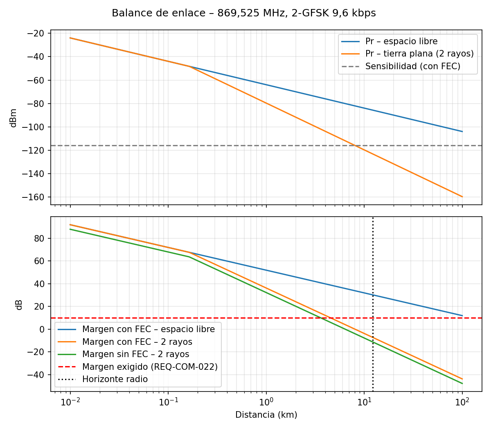

# Enlace de telemetría a 868 MHz con estación de tierra con seguimiento

Proyecto personal que reproduce, a escala, el trabajo de un ingeniero de RF de aviónica en un lanzador:
transmisor de telemetría con tramas estilo CCSDS, receptor SDR propio en GNU Radio, antena directiva con
seguimiento automático y verificación por requisitos según la filosofía ECSS.

**Autor:** Alejandro Berna Mogica · Máster en Sistemas Espaciales (Universidad Europea)

## Estado

| Fase | Contenido | Estado |
|---|---|---|
| F1 | Requisitos, ICD y balance de enlace | 🟡 en curso |
| F2 | Transmisor (Heltec V3 + sensores) | ⚪ |
| F3 | Receptor GNU Radio | ⚪ |
| F4 | Ensayos conducidos (BER) | ⚪ |
| F5 | Antenas y medidas con NanoVNA | ⚪ |
| F6 | Seguimiento az/el | ⚪ |
| F7 | Prueba de campo | ⚪ |
| F8 | Informe y matriz de verificación | ⚪ |

## Estructura

```
docs/          requisitos, ICD, plan de ensayos, informe
analysis/      balance de enlace y cálculos (Python)
firmware/      transmisor (Heltec V3) y seguimiento (ESP32)
ground/        flujos de GNU Radio y scripts de la estación
tests/         scripts de verificación de requisitos
data/          medidas en bruto (CSV)
```

## Balance de enlace

```bash
pip install numpy matplotlib scipy
cd analysis && python link_budget.py
```


